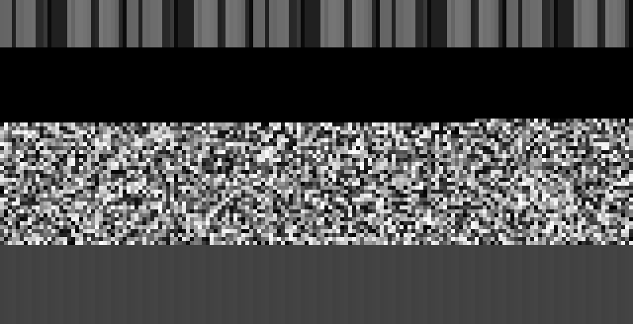
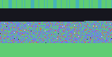
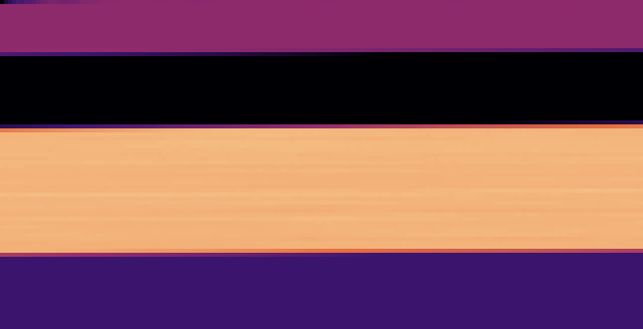
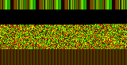
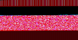
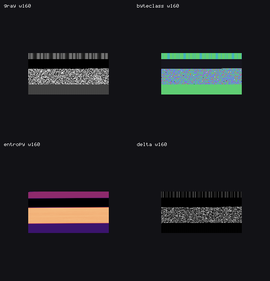
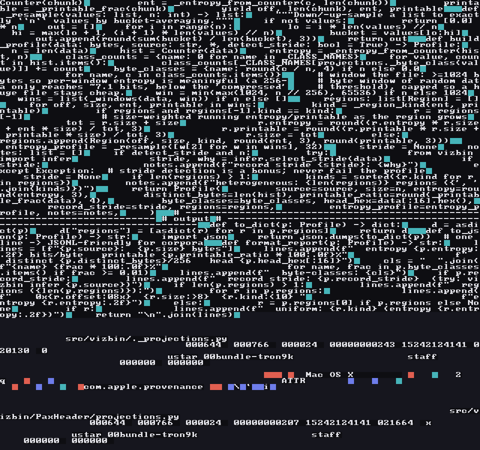
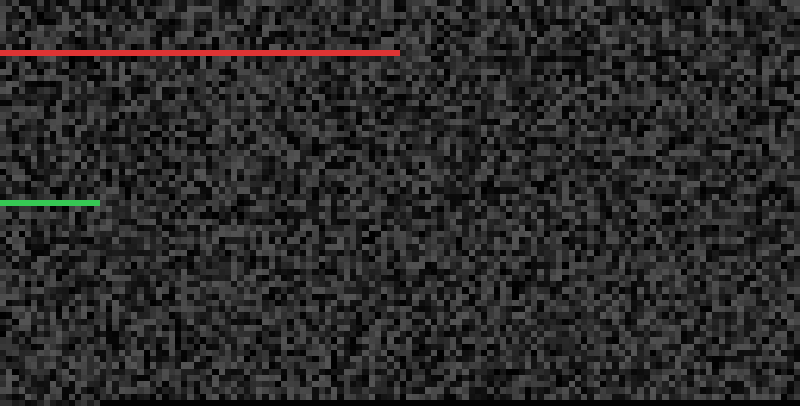

# vizbin gallery

A tool with imaging in its DNA ought to *show* you something. These are real
vizbin outputs on deterministic sample data — regenerate them any time with:

```sh
bash scripts/gen-docs-images.sh   # writes docs/images/*.png
```

Most examples below use one synthetic file, `mixed_regions.bin` — a blob stitched
from a text region, a run of zero padding, a block of pseudo-random
(compressed-looking) bytes, and a periodic `ABCD` tail. The point of vizbin is
that each lens shows a *different* truth about the same bytes.

---

## Projections — the same bytes, different hypotheses

| `gray` — raw byte values | `byteclass` — semantic class |
|---|---|
|  |  |
| Byte magnitude as brightness. The four regions already separate by texture. | nul / whitespace / ascii / control / high-bit, each its own colour. |

| `entropy` — local randomness | `nibble` — hi→red, lo→green |
|---|---|
|  |  |
| Magma ramp: dark = ordered, pale = near-random. The compressed block glows. | The two nibbles of each byte split into colour channels. |

## Composition — combine lenses in one image

Where a projection is a *transform* + a *colorizer*, you can chain or stack them.

| `--rgb entropy,delta,xor` — three measures at once | `-t xor,entropy --paint magma` — a pipeline |
|---|---|
|  |  |
| R = local entropy, G = byte-to-byte change, B = periodicity. Your eye finds where all three light up. | The entropy *of the xor stream*, painted with the magma ramp. Order matters. |

## Contact sheet — many lenses side by side



`vizbin contact mixed_regions.bin --modes gray,byteclass,entropy,delta` — one
image, four hypotheses, for quick triage.

## text mode — a visual `strings` that keeps the structure



`vizbin render src.tar -m text --find "def to_dict"` renders a window of a tar of
vizbin's own source. **Printable ASCII** — the source code *and* the tar's own
text fields (filenames, the `ustar` magic, the octal metadata) — renders as
readable glyphs; you can literally read the `to_dict`/`to_json` methods. The
**non-printable** bytes become the coloured tiles: cyan for the whitespace and
newlines woven between fields and lines, the odd red/purple fleck for the control
and high-bit bytes of the binary extended-attribute blobs, and NUL padding
receding into the near-black background. So you read the strings *and* see the
structural bytes threaded through them. `--find` windows the render on the pattern
(no offset to hunt for).

## diff — what changed between two binaries



`vizbin diff firmware_v1.bin firmware_v2.bin -o diff.bmp` over two "firmware
versions" (an in-place 64-byte patch **and** a 16-byte insertion). Identical
bytes are dimmed to grey; the **red band** is the changed region and the **green
fleck** is the insertion. Because the diff is block-level, the insertion doesn't
smear the rest of the file — it stays 99% identical.

---

The text-output commands (`suggest`, `inspect`, `infer`, `profile`, the `diff`
report) are shown as terminal snippets in the [README](../README.md). And of
course, everything here also renders straight into your terminal with `--term`.

<sub>Made it this far? There's [an easter egg](GHFM-COLOR.md) where a render is drawn
in colour using nothing but LaTeX math. It's ridiculous. It works. Mostly.</sub>
